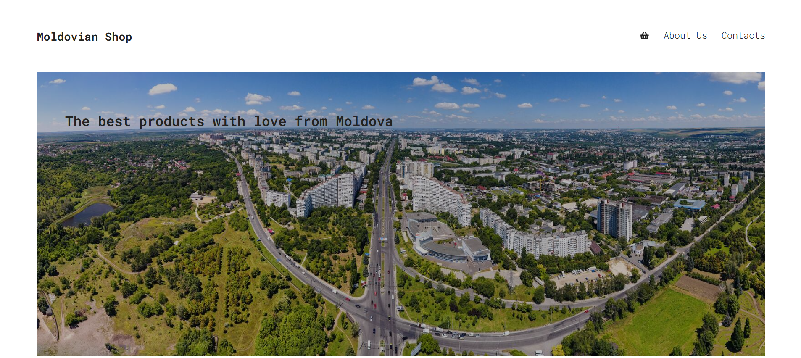
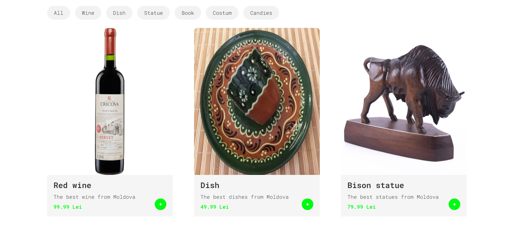
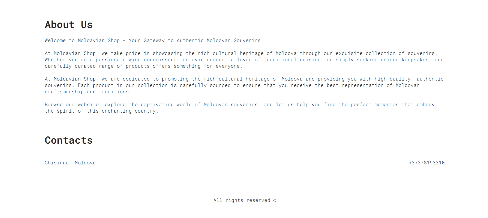
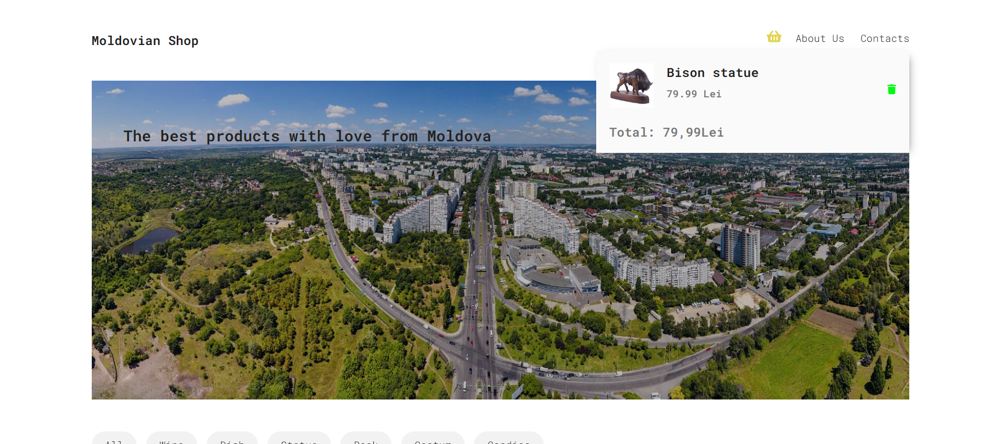

# Moldovan Traditional Shop

Welcome to the **Moldovan Traditional Shop**, a React-based web application showcasing and celebrating the rich cultural heritage of Moldova through traditional items and handcrafted goods.

## 🛍️ About the Project

This is my very first project developed with **React**.  
The goal of the project is to create an online store where users can explore and purchase authentic Moldovan traditional items, such as:

- Handcrafted souvenirs  
- Traditional clothing  
- Ceramics and embroidery  
- Local art and decor

This shop highlights the beauty of Moldovan culture and helps people around the world discover unique products from my homeland.

## 🚀 Features
 
- Product listing and detail pages  
- Shopping cart functionality
- Cultural theme and design inspired by Moldova's heritage  

## 📦 Technologies Used

- React  
- JavaScript / JSX  
- CSS 

## 🧑‍💻 Author

**Danila** – beginner frontend developer

## 📸 Screenshots

### 🏠 Hello Section

---

### 📄 Items Section

---

### ℹ️ Bottom Part of Page

---

### 🛒 Shopping Cart

## 📝 License

This project is for learning and portfolio purposes.  
Feel free to explore or contribute!